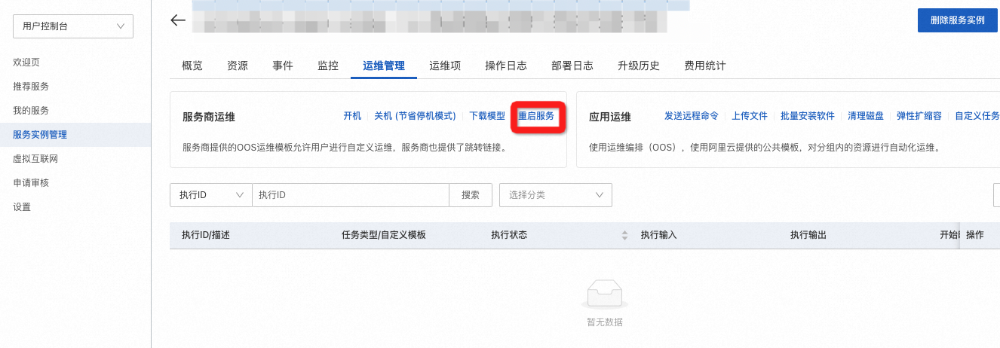

# 基于阿里云DeepGPU实例，用AI画唯美国风少女

>**免责声明：**本服务由第三方提供，我们尽力确保其安全性、准确性和可靠性，但无法保证其完全免于故障、中断、错误或攻击。因此，本公司在此声明：对于本服务的内容、准确性、完整性、可靠性、适用性以及及时性不作任何陈述、保证或承诺，不对您使用本服务所产生的任何直接或间接的损失或损害承担任何责任；对于您通过本服务访问的第三方网站、应用程序、产品和服务，不对其内容、准确性、完整性、可靠性、适用性以及及时性承担任何责任，您应自行承担使用后果产生的风险和责任；对于因您使用本服务而产生的任何损失、损害，包括但不限于直接损失、间接损失、利润损失、商誉损失、数据损失或其他经济损失，不承担任何责任，即使本公司事先已被告知可能存在此类损失或损害的可能性；我们保留不时修改本声明的权利，因此请您在使用本服务前定期检查本声明。如果您对本声明或本服务存在任何问题或疑问，请联系我们。

## 概述

stable diffusion可以通过使用文字生成图片，在整个pipeline中，包含CLIP或其他模型从文字中提取隐变量；通过使用UNET或其他生成器模型进行图片生成。通过逐步扩散(Diffusion)，逐步处理图像，使得图像的生成质量更高。**通过本文，客户可以搭建一个stable diffusion的webui框架，并使用aiacctorch加速图片生成速度。在512x512分辨率下，AIACC加速能将推理性能从1.91s(Doggettx**
**)降低至0.73s，性能提升至2.6倍，同时AIACC支持任意多LORA权重加载，且不影响性能。**
aiacctorch支持优化基于Torch框架搭建的模型，通过对模型的计算图进行切割，执行层间融合，以及高性能OP实现，大幅度提升PyTorch的推理性能。您无需指定精度和输入尺寸，即可通过JIT编译的方式对PyTorch框架下的深度学习模型进行推理优化。具体详见[手动安装AIACC-Inference（AIACC推理加速）Torch版](https://help.aliyun.com/document_detail/317822.html)。


## 计算巢服务创建

### 创建服务

点击[创建链接](https://computenest.console.aliyun.com/user/cn-hangzhou/serviceInstanceCreate?ServiceId=service-2037550c6df74e2caff7)，勾选实例类型，并填写实例密码：

填写登录用户名和密码，用户名和密码在后续登录webui时使用:

点击下一步:确认订单，并勾选服务条款，点击创建：


稍等片刻，等待部署完成。

## 执行图片生成测试

### 登录页面

点击计算巢控制台中的实例:

点击其中的endpoint网址：


### 测试

输入登录信息中的用户名和密码登录:

进入测试页面:

在测试镜像中，我们预装了4个模型:

- guofeng2mix.h1eP.safetensors：国风2 GuoFeng2 模型
- guofeng34.fSJZ.safetensors：国风3 GuoFeng3 模型
- guofeng4125DBeta.5sqe.safetensors：国风4 GuoFeng4 XL 模型
- guofengrealmix21.Awe3.safetensors：国风瑞融 GuoFengRealMix 模型

输入prompt

```bash
best quality, masterpiece, highres, 1girl,blush,(seductive smile:0.8),star-shaped pupils,china hanfu,hair ornament,necklace, jewelry,Beautiful face,upon_body, tyndall effect,photorealistic, dark studio, rim lighting, two tone lighting,(high detailed skin:1.2), 8k uhd, dslr, soft lighting, high quality, volumetric lighting, candid, Photograph, high resolution, 4k, 8k, Bokeh
```

和negative prompt:

```bash
NSFW, lowres, bad anatomy, bad hands, text, error, missing fingers, extra digit, fewer digits, cropped, worst quality, low quality, normal quality, jpeg artifacts, signature, watermark, username, blurry, bad feet,ugly,pregnant,vore,duplicate,hermaphrodite,trannsexual,mutilated,morbid,extra fingers,fused fingers,too many fingers,long neck,mutation,poorly drawn face,poorly drawn hands,mutated hands,deformed,blurry,bad anatomy,bad proportions,disfigured,cloned face,extra limbs,malformed limbs,gross proportions,missing arms,missing legs,extra arms,extra legs,
```

使用默认的模型进行推理，输出如下图:

**耗时为0.78s.**

### 模型切换

我们可以根据输入文字以及生成图片风格，切换模型进行模型推理，例如我们可以通过左上侧的选项卡，选择guofengrealmix21.Awe3.safetensors模型，点击生成，则可生成如下图所示的图像:

**耗时仍为0.78s.**

### LORA功能试用

aiacctorch支持LORA加速，但需要使用Lora所支持的模型。例如可以在guofeng2mix.h1eP.safetensors模型的prompt中加入LORA支持文本:  <lora:Omertosa:1>

可见在aiacctorch加速优化下，LORA加载后性能与加载前相同。

### Controlnet功能试用

Controlnet可以帮助我们生成与原始图相似风格或相似布局的图片，这里以canny为例介绍controlnet功能。
打开Controlnet选项卡，选择controlType为Depth，并上传一张图片，以LENA图为例，进行如下设置：

点击生成：

可见**性能为1.28s**。

### 禁用AIACC加速

我们也可以在settings中禁用aiacctorch。点击settings选项卡，选中aiacctorch，去掉"Apply Aiacctorch in Unet to speedup the whole network inference when loading models"前方的勾，而后点击应用设置：

而后在控制台的运维管理中点击重启服务：

稍等片刻，重新进入页面执行生成命令:

可见关闭aiacctorch并使用xformers后，**推理耗时由0.78s上升至1.39s。**

加入controlnet后，关闭aiacctorch的耗时则会**从1.28s上升至2.26s。**


## Q&A

### 如何重启服务

- 可使用如下命令停止服务:

```bash
    systemctl stop sdwebui 
```

- 可使用如下命令打开服务:

```bash
    systemctl start sdwebui
```

### 如何查看log

```bash
    cat /var/log/sdwebui.log
```

### 出现AttributeError: 'NoneType' object has no attribute 'loaded_loras'怎么解决

如果使用dreambooth库，则会导致内置的lora模块失效，则会出现如下问题:

### 

需要解决这个问题，请关闭sd_dreambooth_extension：

而后应用并重启界面，
然后重启服务：

```bash
systemctl stop sdwebui
systemctl start sdwebui
```

### 如何设置服务进程退出后自动重启

- 修改/lib/systemd/system/sdwebui.service，将Restart设置成always，则服务进程异常退出后会立刻重启。


